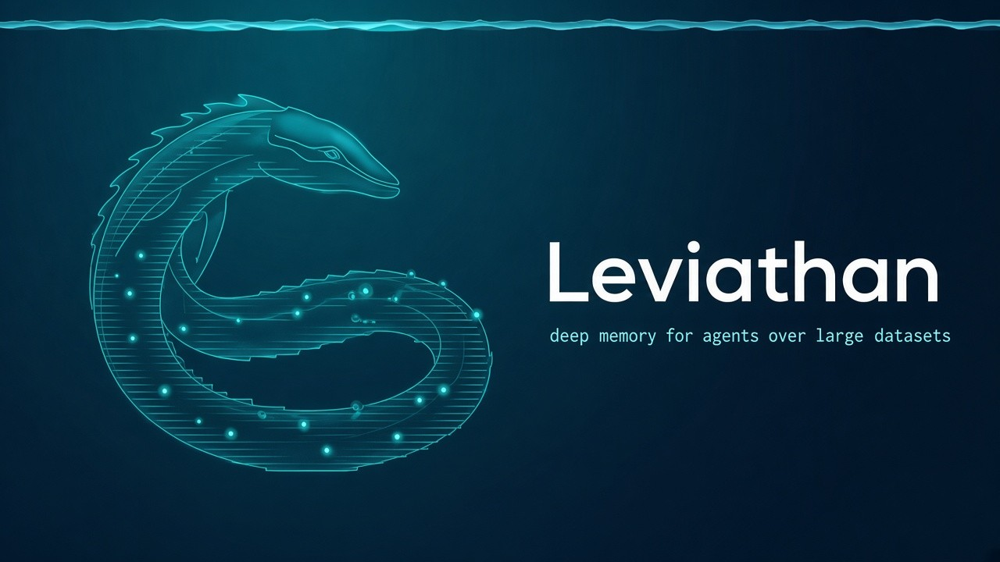

<p align="center">
  
</p>

<h1 align="center">Leviathan</h1>

<p align="center">
  <b>Deep memory for agents over large datasets.</b><br>
  Index any table, export or log once. Then give your agent the few records that answer<br>
  the question: ~450 tokens per call, at any size, instead of reading the data.
</p>

<p align="center">
  <a href="https://github.com/elstongun/leviathan/actions/workflows/ci.yml"></a>
  <a href="LICENSE"></a>
  
  
  
</p>

---

Agents are good at reasoning over a handful of records and bad at finding
them in a million. Asked *"has Acme hit this login loop before?"* or *"what
fixed this pump last time?"*, they grep an export or page through an API, and
they pay for every line they read. Past a few hundred thousand rows, the raw
history of a single customer, host or machine no longer fits in a context
window.

Leviathan is a single static binary that turns your records (JSONL, JSON,
CSV/TSV, SQLite, or anything a database CLI can export) into a ranked
full-text index. Tell it, or let it infer, which field is the id, which entity
people ask about, which fields are text, dates and filters. Your agent then
asks in plain words and gets back short, cited **result cards**: the
best-matching records, with the fields that matter and the sentence that
matched.

<p align="center">
  
</p>

| At 1,000,000 records (678 MB of JSONL) | Leviathan | best grep strategy |
|---|---:|---:|
| Median tokens put into the agent's context | **436** | 107,122 (245× more) |
| Relevant record returned | **99.0%** in top 5 · 98.5% at rank 1 | 96.0% somewhere in a 30K-char tool output |
| Worst case across 1,200 questions | **602 tokens** | 9.7M tokens |
| Median latency, process start included | **33 ms** | 92 ms |
| Calls needed | **1** | 1 + a lot of reading |

The example dataset is a synthetic maintenance log for an invented facility,
with 200 gold-labeled questions per scale. It is one example; nothing in
Leviathan is specific to it. Everything is reproducible with one command; see
[Benchmarks](#benchmarks) for the methodology and the caveats.

## Contents

- [Quickstart](#quickstart)
- [Install](#install)
- [Map your data](#map-your-data)
- [Any database](#any-database)
- [Plug it into your agent](#plug-it-into-your-agent)
- [Commands](#commands)
- [How it works](#how-it-works)
- [Benchmarks](#benchmarks)
- [Design principles](#design-principles)
- [Roadmap](#roadmap)
- [Contributing](#contributing) · [Security](#security) · [License](#license)

## Quickstart

```bash
cargo install --git https://github.com/elstongun/leviathan leviathan
cd examples/tickets                  # 24 support tickets + leviathan.toml
leviathan index                      # -> ./leviathan.db
leviathan search -g acme "sso login loop after password reset"
```

```text
leviathan search · customer C-ACME "Acme Corp" (7 tickets) · query "sso login loop after password reset" · shown 3 of 3 · 24 tickets indexed
[1] T-1001 · 2024-01-08 09:12 · rel 16.9
  Login loops back to sign-in page after password reset
  status: closed · priority: high
  resolution: Cleared stale session cookies on password reset; shipped in 4.2.1. Workaround: clear site data.
  match: Users who reset their password get redirected to the sign-in page again in an endless loop.
[2] T-1006 · 2024-03-11 14:20 · rel 6.5
  SSO login fails for new employees
  ...
next: `leviathan get <id>` for a full ticket
```

`-g` takes the group the way a person says it: a key (`C-ACME`), a name
(`"Acme Corp"`), or part of one (`acme`). When it is ambiguous or unknown,
Leviathan refuses to guess, lists the candidates, and exits with 3:

```text
$ leviathan search -g "c-" "export"
leviathan search · 4 customers match "c-"; ask which one, then retry with its exact key
  C-ACME "Acme Corp" · 7 tickets · contains
  C-GLOBEX "Globex Industries" · 6 tickets · contains
  ...
```

When nothing matches inside the group, Leviathan looks in the other groups
and labels every card that comes from one, so the agent can say so:

```text
$ leviathan search -g acme "webhook 401" -n 1
leviathan search · customer C-ACME "Acme Corp" (7 tickets) · query "webhook 401" · shown 0 of 0 · 24 tickets indexed
no matching tickets (none found, not none exist: try fewer or different words)
[1] T-1003 · OTHER CUSTOMER C-GLOBEX "Globex Industries" · 2024-02-02 08:30 · rel 8.9
  Webhook deliveries failing with 401
  ...
```

Filters, date ranges, phrases and exclusions combine freely:

```bash
leviathan search "sso certificate" --where status=closed --since 2024-06
leviathan search '"password reset" -mobile' --where priority=high --where priority=urgent
leviathan recent -g globex --until 2024-03-31
```

## Install

| Method | Command |
|---|---|
| Prebuilt binary | download from [Releases](https://github.com/elstongun/leviathan/releases) (Linux x86_64/arm64, macOS x86_64/arm64, Windows x86_64, with SHA-256 checksums) |
| Cargo | `cargo install --git https://github.com/elstongun/leviathan leviathan` |
| From source | `git clone … && cargo build --release` → `target/release/leviathan` |

There are no runtime dependencies. SQLite is compiled in, and the index is a
single file you can copy, back up, or mount read-only.

## Map your data

Leviathan needs to know a few things about a record. Every one of them is a
path into the record (`a.b` for nesting, `items[].name` for every element of
an array), and only `id` is required:

| Field | What it enables |
|---|---|
| `id` | `get`, `upsert`, `delete`, citations |
| `title` | The headline on every card, weighted higher in ranking |
| `text` | What is searched (default: every string field) |
| `group` / `group_name` | `-g`: scoped search, name resolution, labeled fallback |
| `date` | `--since` / `--until`, `recent`, newest-first listing |
| `filters` | `--where field=value`, value counts in `describe` |
| `display` | The fields printed on every card |
| `empty_values` | Placeholders such as `"n/a"` or `"done"` that should count as missing |
| `rank.boost` | Favor records that are filled in or in a given state |

There are three ways to provide the mapping, and they compose (flags
override the file):

```bash
# 1. Let Leviathan propose one: samples the data, writes a commented leviathan.toml
leviathan init ./export
leviathan index

# 2. Flags, for one-offs and scripts
leviathan index tickets.csv --id "Ticket ID" --group customer_id --date created_at --filter status

# 3. A leviathan.toml written by you, or by your agent from a schema it already knows
leviathan index -c tickets.toml
```

`init` reports why it picked each field (uniqueness, cardinality, average
length, how many values parse as dates), so an agent can review it in one
pass. Run `leviathan describe` afterwards to see what the index contains:

```text
leviathan index leviathan.db · Example support desk
  24 tickets · 4 customers · dates 2024-01-08 .. 2024-12-02 · 0.1 MB
filters (--where field=value; repeat a field for any-of):
  status: closed 21 · open 3
  priority: normal 10 · high 7 · low 4 · urgent 3
  ...
largest customers: C-ACME "Acme Corp" 7 · C-GLOBEX "Globex Industries" 6 · ...
```

[docs/CONFIG.md](docs/CONFIG.md) has the full reference, and a recipe for
agents writing a config from a schema.

## Any database

Leviathan doesn't hold database credentials or speak wire protocols. It reads
what your database's own CLI already exports:

```bash
psql "$DATABASE_URL" -At -c "SELECT row_to_json(t) FROM tickets t" | leviathan index - -c tickets.toml
mysql -B -e "SELECT * FROM tickets" app | leviathan index - --format tsv -c tickets.toml
leviathan index app.db --sql "SELECT * FROM tickets" -c tickets.toml
duckdb -json -c "SELECT * FROM 'events/*.parquet'" | leviathan index - -c events.toml
mongoexport --db app --collection tickets | leviathan index - --id '_id.$oid' -c tickets.toml
```

Builds are atomic: a new index is written beside the old one and swapped in,
and a rebuild is skipped when neither the sources nor the mapping changed.
Keep it fresh with `leviathan upsert` (insert or replace by id) and
`leviathan delete`, for example from a nightly export of changed rows.

## Plug it into your agent

Leviathan is **CLI-first**, like [ripwire](https://github.com/redhat-et/ripwire).
Any agent with a shell (Claude Code, Codex, Cursor, Gemini CLI, Aider, your
own) can already call it. The only setup is telling the agent *when* to call
it, and the bundled [skill](skills/leviathan/SKILL.md) does exactly that:

```bash
# Claude Code / any agent that reads skills
cp -r skills/leviathan ~/.claude/skills/
# or paste skills/leviathan/SKILL.md into AGENTS.md / CLAUDE.md / .cursor/rules
```

**MCP is optional.** For agents without a shell (Claude Desktop, chat UIs, or
locked-down sandboxes), `leviathan mcp` serves the same index as four
read-only tools over stdio. The search tool's description includes a summary
of *your* dataset (record and group nouns, date range, filter fields and
their top values), so the model knows what it can ask without a discovery
call. MCP tool schemas are loaded into *every* session whether you use them
or not; Leviathan's cost about 640 tokens. The CLI plus a skill costs nothing
until it is called.

| MCP tool | Purpose |
|---|---|
| `search` | Ranked records for words, optionally scoped to a group (`group`, `others`, `all`), filtered and date-bounded; no words lists newest first |
| `resolve_group` | Turn "acme" into candidate group keys |
| `get` | One complete record, exactly as ingested |
| `describe` | Fields, groups, filter values with counts, date range, example calls |

`leviathan wrap <agent>` prints the exact config for your agent:

```bash
leviathan wrap claude     # claude mcp add leviathan -- …
leviathan wrap cursor     # .cursor/mcp.json
leviathan wrap codex      # ~/.codex/config.toml
leviathan wrap vscode     # .vscode/mcp.json
leviathan wrap gemini     # ~/.gemini/settings.json
leviathan wrap windsurf   # ~/.codeium/windsurf/mcp_config.json
leviathan wrap generic    # any stdio MCP client
```

The server speaks MCP protocol versions 2025-11-25, 2025-06-18, 2025-03-26 and
2024-11-05, and reloads the index automatically when a rebuild swaps in a new
file.

## Commands

| Command | What it does |
|---|---|
| `leviathan init <paths…>` | Sample the data and write a commented `leviathan.toml` (`--json` for the proposal with statistics) |
| `leviathan index [paths…]` | Build the index (atomic; no-op when unchanged; `--force`, `--strict`) |
| `leviathan upsert <paths…>` | Insert or replace records by id, without a rebuild |
| `leviathan delete <id…>` | Remove records by id |
| `leviathan search [-g GROUP] [words…]` | Ranked records (`--scope group\|others\|all`, `--where`, `--since`, `--until`, `-n` up to 50, `--offset`) |
| `leviathan recent [-g GROUP]` | Newest records, with the same filters |
| `leviathan resolve <group>` | Candidate groups for a key or name |
| `leviathan get <id…>` | Complete records as JSON, exactly as ingested |
| `leviathan describe` | What is in the index, and example calls |
| `leviathan mcp` | MCP server on stdio |
| `leviathan wrap <agent>` | Print agent configuration |

Global options are `--index PATH` (env `LEVIATHAN_INDEX`, default
`./leviathan.db`), `--json` for machine-readable output on every command, and
`--max-chars N` (env `LEVIATHAN_MAX_CHARS`, default 300) to cap each field on
a card. Search words support `"exact phrases"` and `-exclusions`; quote the
whole query when it contains an exclusion (`"login -sso"`).

| Exit code | Meaning |
|---|---|
| `0` | Success, **including zero hits** (the output says so explicitly) |
| `1` | Error (missing index, I/O, bad data in `--strict` mode) |
| `2` | Usage error or bad request (unknown filter field, bad date) |
| `3` | Group unknown or **ambiguous**: candidates are listed; ask the user |

## How it works

```text
  records ──► stream + map fields ──► SQLite (one file)
  (JSONL, JSON, CSV,                    ├─ records    (stored record, id, group, date, boost)
   SQLite, stdin, .gz)                  ├─ groups     (key, name, normalized name, count)
                                        └─ record_fts (FTS5: title, body, names, tags; contentless)

  search -g "acme" "login loop" --where status=closed --since 2024-06
     1. resolve the group: exact key → case-insensitive → name → contains → fuzzy; ambiguous = refuse
     2. one FTS5 MATCH: words, plus group and filter tokens, so scoping costs no post-filtering
     3. rank by BM25 (title weighted 2×) × configured boosts; the date bounds are SQL conditions
     4. render the top N as compact cards; only those N records are ever decoded
```

- **Scoping is part of the match.** Groups and filter values are indexed as
  synthetic tokens, so `-g acme --where status=open` narrows the full-text
  match itself instead of filtering a result list, and a group with tens of
  thousands of records is never scanned.
- **A record's own names don't count as evidence.** Within a group, every
  record mentions the group's name. Leviathan indexes names separately and
  matches only titles and bodies in scoped searches, so *"Hydraulic Press 01
  losing pressure"* ranks on "losing pressure".
- **Placeholders are missing values.** Values listed in `empty_values` (such
  as `"n/a"` or `"done"`) are neither searched nor shown, and don't satisfy a
  "field is present" boost.
- **Bounded output.** Every field on a card is capped, and the snippet is the
  best-matching sentence. The result is a stable ~450 tokens per answer at
  any dataset size: the largest across all 1,200 benchmark questions was 602.
- **Honest counts.** Every answer carries `shown N of M` and the index size,
  so an agent can tell "nothing matched" from "nothing exists".

## Benchmarks

The question an agent gets most over a large dataset is about **one entity**:
*"has this customer hit this before?"*, *"what fixed this machine last
time?"*. For each question we measure what lands in the agent's context,
whether a relevant record is in there, and how long it took. Four strategies
are compared on the same dataset:

| Strategy | What the agent runs |
|---|---|
| **Leviathan** | `leviathan search -g <entity as asked> "<question>" -n 5` |
| grep entity + question words | `rg -F '"<key>"' data.jsonl \| rg -i -e <word> -e <word> …` |
| grep entity history | `rg -F '"<key>"' data.jsonl` |
| read the whole dataset | the file itself |

The example dataset is a synthetic maintenance log (an invented facility with
1,500 machines, heavy-tailed histories, placeholder write-ups and look-alike
planned services), because that is a hard, realistic shape: many records per
entity, most of them irrelevant to the question. The grep baselines are
handed the exact entity key even when the question used its name, an
advantage a real agent doesn't have.

<p align="center">
  
  
</p>
<p align="center">
  
  
</p>

| Records | Dataset | Leviathan median tokens | grep + words | grep history | Leviathan hit@1 / hit@5 | grep + words: answer within 30K chars | Leviathan p50 | grep history p50 | Build | Index |
|---:|---:|---:|---:|---:|---|---:|---:|---:|---:|---:|
| 10,000 | 7 MB | **404** | 1,182 | 2,193 | 90.0% / 97.5% | 99.0% | 11 ms | 6 ms | 0.4 s | 14 MB |
| 100,000 | 68 MB | **443** | 7,750 | 18,484 | 93.5% / 98.0% | 98.5% | 15 ms | 14 ms | 4.3 s | 124 MB |
| 250,000 | 170 MB | **456** | 17,044 | 35,496 | 94.0% / 98.0% | 97.5% | 19 ms | 25 ms | 11 s | 300 MB |
| 1,000,000 | 678 MB | **436** | 107,122 | 209,412 | 98.5% / 99.0% | 96.0% | 33 ms | 89 ms | 52 s | 1.2 GB |

On small datasets grep is fast and cheap enough; Leviathan earns its keep as
the data grows. At 1M records, one entity's raw history overflows a
200K-token context window for half of the questions, while Leviathan's
answer stays under 610 tokens. Full tables (all six scales, means, p90,
maxima), the methodology and the limitations are in
[docs/BENCHMARKS.md](docs/BENCHMARKS.md).

Reproduce:

```bash
python3 -m venv bench/.venv && bench/.venv/bin/pip install -r bench/requirements.txt
bench/.venv/bin/python bench/run_bench.py      # 10K → 1M records, ~30 min, ~4 GB disk
bench/.venv/bin/python bench/report.py         # charts → docs/assets, table → bench/results/SUMMARY.md
```

<p align="center">
  
</p>

## Design principles

1. **Never guess the entity.** An answer about the wrong customer or machine
   is worse than no answer. When a group is ambiguous, Leviathan exits with 3
   and lists the candidates.
2. **Cite everything.** Every card carries its record id, group and date.
   Results from outside the requested group are labeled as such.
3. **Say what you didn't find.** Zero hits is a normal, explicit outcome, and
   the counts are always shown.
4. **Spend the context window like it's money.** Compact text by default,
   capped fields, records decoded only for the final top N, and CLI-first so
   idle sessions cost nothing.
5. **Schema-agnostic, not schema-blind.** Nothing is hard-coded to a domain;
   a few lines of mapping (inferred or written by an agent) are all it needs.
6. **Read-only and local.** Leviathan never writes to your sources, never
   calls the network, and needs no service to run. See
   [SECURITY.md](SECURITY.md) for the threat model.

## Roadmap

- [ ] Multiple record types in one index (tickets and their comments, hosts and their events)
- [ ] Optional embedding re-rank for vocabulary mismatch ("weeping" vs "leak")
- [ ] Numeric range filters (`--where amount>100`)
- [ ] Streamable HTTP MCP transport for shared, read-only deployments
- [ ] An LLM-in-the-loop benchmark that grades the final answer, not just retrieval

Ideas, example configs for public datasets, and benchmark scenarios are very
welcome; see [CONTRIBUTING.md](CONTRIBUTING.md).

## Contributing

Bug reports, configs and ranking improvements are all welcome. Read
[CONTRIBUTING.md](CONTRIBUTING.md) first. Changes to ranking or output must
include before-and-after benchmark numbers, and a change that saves tokens
but loses answers won't be merged. This project follows the
[Contributor Covenant](CODE_OF_CONDUCT.md).

## Security

Indexed data can be sensitive. Leviathan is read-only, offline and
`unsafe`-free; please report vulnerabilities privately as described in
[SECURITY.md](SECURITY.md).

## License

Licensed under the [Apache License, Version 2.0](LICENSE). Third-party
licenses are listed in [THIRD_PARTY.md](THIRD_PARTY.md).
