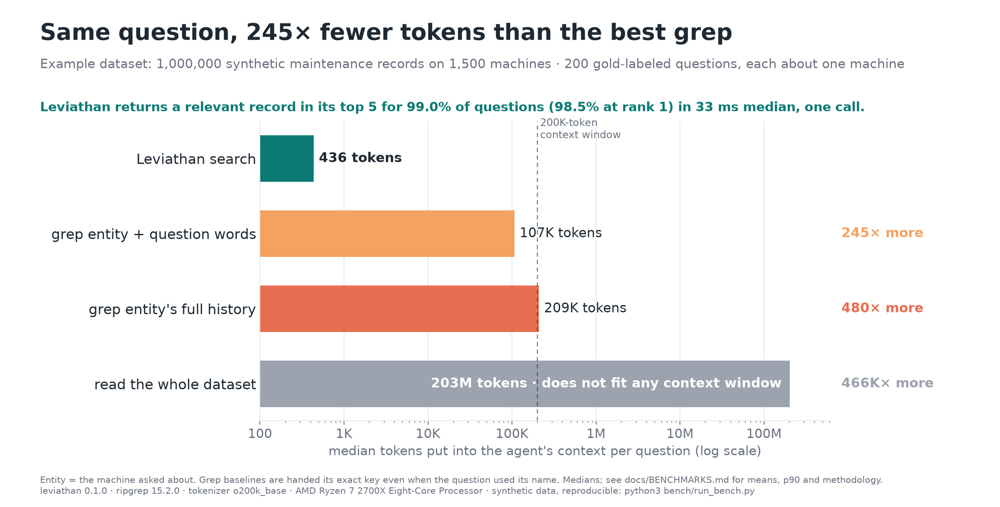
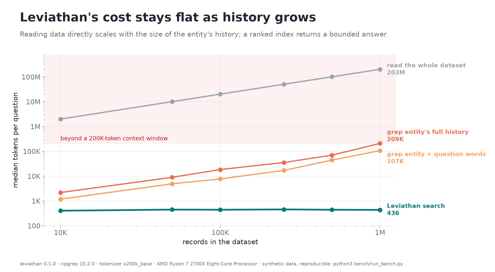
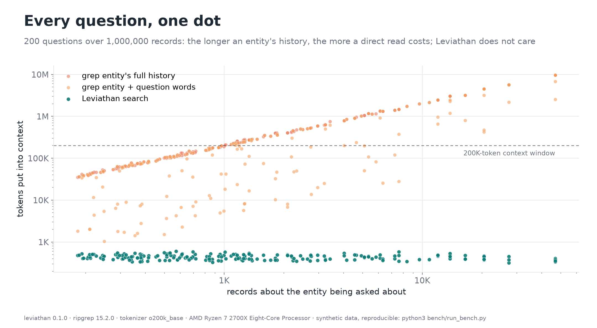
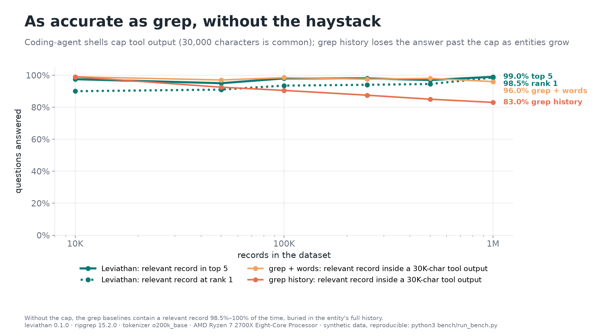
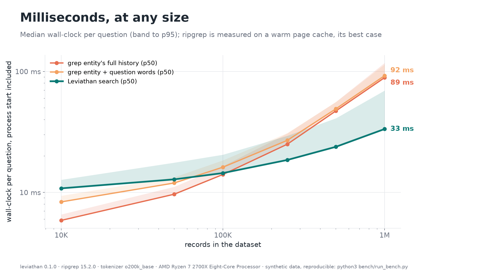
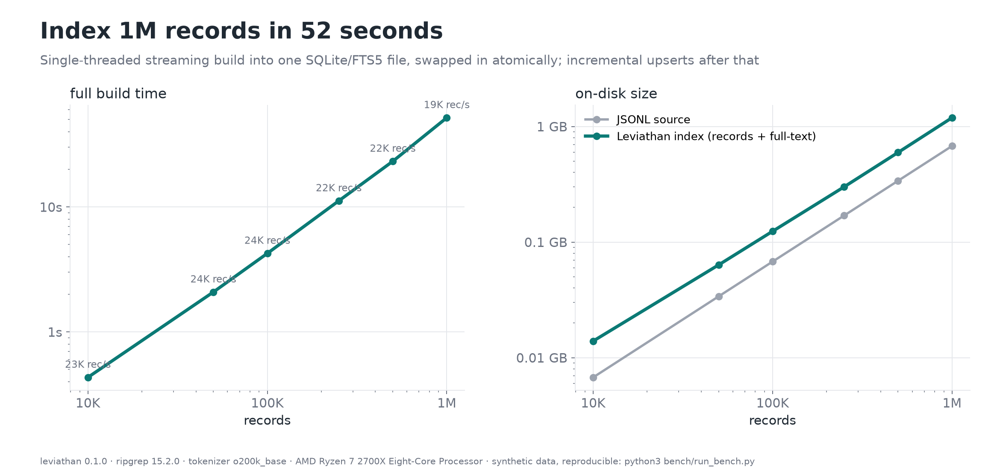

# Benchmarks

**Question:** when an agent is asked about one entity in a large dataset
(*"what fixed this machine last time?"*, *"has this customer hit this
before?"*), how much does it have to read, and does it get the answer?

**Short answer, at 1,000,000 records:** Leviathan puts a median of **436
tokens** into the agent's context and returns a relevant record in its top 5
for **99.0%** of questions (98.5% at rank 1) in **33 ms**. The best
grep-based strategy puts a median of **107,122 tokens** (245× more) into the
context, and for half of the questions the entity's raw history doesn't fit
in a 200K-token context window at all.

Everything below is reproducible with one command on a desktop machine.

## Setup

### Dataset

The example dataset is a synthetic maintenance log for an invented facility,
generated by `bench/synth`. Leviathan has no knowledge of it beyond the
mapping in [`examples/maintenance/leviathan.toml`](../examples/maintenance/leviathan.toml);
the same engine indexes tickets, logs or any other records. Maintenance makes
a good test because it is a hard shape: thousands of records per entity, most
of them routine and irrelevant to the question, with the useful ones written
in inconsistent words.

The generator is deterministic (the same arguments always produce the same
bytes) and is designed to be unkind to search:

| Property | Value |
|---|---|
| Entities | 1,500 machines of 11 invented types (air handlers, presses, cranes, saws, …), named like `HPR-Q01` / "Hall Q Hydraulic Press 01" |
| History skew | Zipf-like (exponent 0.75), so the busiest machines have tens of thousands of records |
| Record mix | 50% planned services, 38% corrective/breakdown, 12% requests; 2014–2026 |
| Failure modes | 27 (7 generic, 20 type-specific); each machine has one or two *chronic* modes that recur |
| Placeholder write-ups | 27% of corrective resolutions are placeholders ("done", "fixed", "see notes") and 15% are empty; 82% of planned services have only a placeholder |
| Distractors | Planned services whose checklists mention the same components, free-text notes, shop context, unrelated requests |

Records are nested JSON (`asset{id,name}`, `codes{problem,cause,action}`,
`steps[]`, `parts[]`, `labor[]`, optional `plan`) with explicit nulls, so the
mapping exercises paths and arrays.

### Questions and gold labels

The generator writes 200 questions per scale. Each picks a machine and one of
its failure modes that has at least one record with evidence of what was
done. The question is phrased with a separate *ask* vocabulary, not copied
from record text, and sometimes starts with a lead such as "again", "what
fixed" or "how did we fix". The machine is named the way a person would: 50%
by key, 30% by name, and 20% by lowercase name.

A record is **relevant** to a question when it is on the same machine,
records the same failure mode, and carries evidence (a real resolution,
executed steps, parts or a technician note). Questions typically have several
relevant records (a median of 90 at 1M); any one counts as an answer.

### Strategies

| Strategy | Command | Notes |
|---|---|---|
| **Leviathan** | `leviathan search -g <machine as asked> "<question>" -n 5` | Default compact text output, one call |
| grep entity + question words | `rg -F '"<key>"' data.jsonl \| rg -i -e <w1> -e <w2> …` | The question's content words (length ≥ 3, stopwords removed) |
| grep entity history | `rg -F '"<key>"' data.jsonl` | What an agent reads to "look at the machine's history" |
| read the whole dataset | the file | Computed once per scale, not run per query |

The grep strategies are **handed the exact key**, even for questions that
named the machine by its human name. A real agent would first have to work
out the key, so these baselines are optimistic.

### Metrics

- **Tokens** are what the agent's context would receive, counted with
  tiktoken `o200k_base`. Outputs under 1 MB are counted exactly; larger ones
  are extrapolated from an even 512-line sample; against exact counts on the
  four largest 1M outputs (10–32 MB), the error was at most 0.28%.
- **hit@1 / hit@5 / MRR@5** (Leviathan): a relevant record at rank 1, in the
  top 5, and the mean reciprocal rank.
- **Answer within the cap** (grep): a relevant record id appears in the first
  30,000 characters of output, a common tool-output cap in coding agents.
  Uncapped, the grep outputs contain a relevant record 98.5–100% of the time.
- **Latency** is wall-clock per call, including process start, measured from
  Python's `subprocess`. ripgrep runs on a warm page cache, its best case.
- **MCP schema cost** is the token count of `tools/list` (compact JSON) for
  an index of the 1M dataset, including its dataset summary: **638 tokens**,
  paid in every session when Leviathan is registered as an MCP server. The
  CLI plus a skill costs 0 until it is called.

### Environment

AMD Ryzen 7 2700X (8 cores, 16 threads), Linux, Leviathan 0.1.0 (release
build), ripgrep 15.2.0, Python 3.12, tiktoken `o200k_base`. The seed is 7
everywhere.

## Results

<p align="center"></p>

### Tokens and answers

| Records | Dataset | Leviathan median tokens | grep + words | grep history | read all | Leviathan hit@1 / hit@5 / MRR@5 | grep + words: answer within cap | grep history: answer within cap |
|---:|---:|---:|---:|---:|---:|---|---:|---:|
| 10,000 | 7 MB | **404** | 1,182 | 2,193 | 2.0M | 90.0% / 97.5% / 0.933 | 99.0% | 99.0% |
| 50,000 | 34 MB | **449** | 4,923 | 8,992 | 10M | 91.0% / 95.0% / 0.929 | 97.0% | 92.5% |
| 100,000 | 68 MB | **443** | 7,750 | 18,484 | 20M | 93.5% / 98.0% / 0.952 | 98.5% | 90.5% |
| 250,000 | 170 MB | **456** | 17,044 | 35,496 | 51M | 94.0% / 98.0% / 0.954 | 97.5% | 87.5% |
| 500,000 | 339 MB | **442** | 44,479 | 70,336 | 102M | 94.5% / 97.0% / 0.956 | 98.0% | 85.0% |
| 1,000,000 | 678 MB | **436** | 107,122 | 209,412 | 203M | 98.5% / 99.0% / 0.987 | 96.0% | 83.0% |

Leviathan's cost is flat while every direct read grows with the data.
Its accuracy *rises* with scale, because larger datasets give each question
more relevant records and better term statistics. At 10K records, rank 1 is
the weak spot (90%): some questions share no words with the few relevant
records, and the right answer lands at rank 2–5.

grep + words often has a relevant record somewhere in its first 30K
characters, because questions have many relevant records and keyword
matches surface some of them early. But that is roughly 7,500 tokens of
unranked lines to read and judge, against Leviathan's ~450 tokens of ranked
cards, and past the cap the output is simply cut off. The entity's full
history loses the answer past the cap more and more as histories grow.

### Tails

Medians flatter the grep strategies; the busiest entities are where agents
really break.

| Records | Leviathan mean / p90 / max | grep + words mean / p90 / max | grep history mean / p90 / max | grep history fits a 200K window |
|---:|---|---|---|---:|
| 10,000 | 350 / 496 / 569 | 5,301 / 11,107 / 104,059 | 7,113 / 13,641 / 104,059 | 100% |
| 50,000 | 428 / 514 / 582 | 20,653 / 40,717 / 497,175 | 38,385 / 66,999 / 497,175 | 96% |
| 100,000 | 428 / 508 / 593 | 42,478 / 95,730 / 985,758 | 73,277 / 140,041 / 985,758 | 92% |
| 250,000 | 444 / 528 / 581 | 102,024 / 212,119 / 2,433,454 | 149,378 / 376,420 / 2,433,454 | 83% |
| 500,000 | 439 / 513 / 568 | 187,166 / 292,111 / 4,876,870 | 300,293 / 662,921 / 4,876,870 | 78% |
| 1,000,000 | 437 / 512 / 602 | 571,532 / 1,415,519 / 9,691,544 | 840,727 / 2,465,482 / 9,691,544 | 50% |

The largest Leviathan answer across all 1,200 questions was 602 tokens. With
`--json`, the median at 1M is about 555 tokens.

<p align="center">
  
  
</p>
<p align="center"></p>

### Latency

| Records | Leviathan p50 / p95 | grep history p50 |
|---:|---:|---:|
| 10,000 | 10.8 / 12.7 ms | 5.9 ms |
| 50,000 | 12.8 / 17.6 ms | 9.7 ms |
| 100,000 | 14.5 / 20.5 ms | 14.1 ms |
| 250,000 | 18.5 / 29.4 ms | 25.0 ms |
| 500,000 | 23.8 / 41.0 ms | 47.2 ms |
| 1,000,000 | 33.4 / 69.6 ms | 88.9 ms |

Up to about 100K records grep is as fast or faster; most of Leviathan's time
at that size is process start and opening the index. The gap opens with
size. For an agent, latency matters less than tokens: reading 107K tokens
costs far more time in the model than 90 ms of grep.

<p align="center"></p>

### Indexing

| Records | Build | Throughput | Index size (source size) |
|---:|---:|---:|---:|
| 10,000 | 0.4 s | 23K records/s | 14 MB (7 MB) |
| 100,000 | 4.3 s | 24K records/s | 124 MB (68 MB) |
| 1,000,000 | 52 s | 19K records/s | 1.2 GB (678 MB) |

The build is a single-threaded stream into one SQLite file, swapped in
atomically. Build times vary by tens of percent between runs depending on
background load. The index is about 1.8× the source, because it stores each
record for display and `get` alongside the full-text index and the facet
counts. Daily changes go through `leviathan upsert` and don't need a rebuild.

<p align="center"></p>

## Limitations

Please read these before quoting the numbers.

- **The data is synthetic.** It was built to include the failure cases that
  make search hard (placeholder write-ups, look-alike routine records, skewed
  histories, different words in questions and records), but real data has
  messier text and more vocabulary drift. Treat the accuracy figures as an
  upper bound and the token figures as representative.
- **One example dataset.** The engine is schema-agnostic, but the numbers
  come from one shape of data: many records per entity, questions about one
  entity. Datasets without a natural group, or questions that span the whole
  dataset, behave differently.
- **This measures retrieval, not the final answer.** No LLM reads the
  output. A model given 107K tokens of grep output might still find the
  answer when it fits, but it pays for every token, and at scale it often
  doesn't fit. An LLM-in-the-loop benchmark is on the roadmap.
- **The baselines are simple on purpose.** A careful agent could grep
  smarter: iterate on keywords, page through results, use `jq`. Each of those
  costs more calls and tokens, and every one starts by reading raw records.
  The grep baselines also get the exact key for free.
- **Lexical retrieval.** Leviathan uses BM25 with stemming. A question that
  says "weeping" where the records say "leak" relies on its other words.
- **One machine, one run.** The latencies are from a single 2018 desktop CPU;
  expect different absolute numbers on other hardware.

## Reproduce

```bash
cargo build --release --workspace
python3 -m venv bench/.venv && bench/.venv/bin/pip install -r bench/requirements.txt
bench/.venv/bin/python bench/run_bench.py          # all six scales, ~30 min, ~4 GB in bench/data/
bench/.venv/bin/python bench/report.py             # charts -> docs/assets/, table -> bench/results/SUMMARY.md
```

| Flag | Effect |
|---|---|
| `--scales 10000,100000` | Choose dataset sizes |
| `--queries 200 --machines 1500 --seed 7` | Generator parameters (defaults shown) |
| `--leviathan-only` | Re-measure Leviathan only and reuse cached grep baselines; use this after ranking or output changes |
| `--rerun` / `--regenerate` | Ignore cached results / regenerate datasets |

Set `RG=/path/to/rg` to choose the ripgrep binary. Raw per-question results
for the largest scale are in
[`bench/results/results.json`](../bench/results/results.json). The CI job
`bench-smoke` runs the 10K scale on every pull request and fails if hit@5
drops below 93% or the median answer grows past 1,500 tokens.
