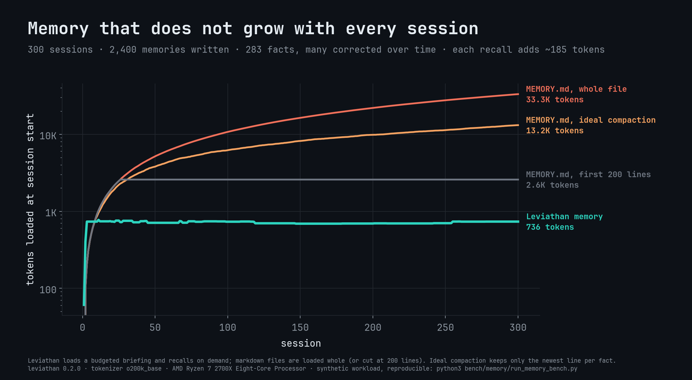
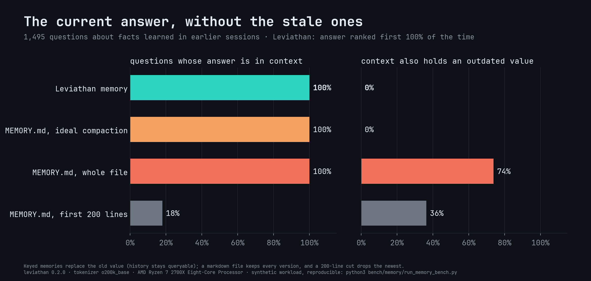
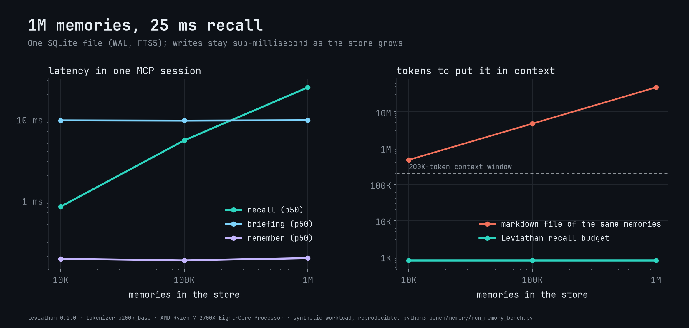

# Memory

Agents usually remember by summarizing old conversations into a markdown
file and loading all of it into every session. The file grows with every
session, keeps every outdated version of every fact, and gets cut off or
re-summarized when it is too long, losing whatever the cut drops.

Leviathan memory is a small read/write database for agents instead. The
agent writes one claim at a time (`remember`), reads back only what fits a
token budget (`recall`), and gets a short briefing when a session starts.
Anything that can change has a `key`, so the next write replaces the old
value rather than piling up next to it. History is kept, queryable, and
never loaded by accident.

<p align="center">
  
</p>
<p align="center">
  
  
</p>

The numbers are from `bench/memory` (see [Benchmark](#benchmark)).

- It's optional. Nothing changes until you pass `--memory`.
- It lives in its own file (`~/.leviathan/memory.db` by default), separate from any data index. Indexes stay read-only.
- Writes are explicit. Only the agent's (or your) `remember` calls write, and no model runs inside Leviathan.
- It works with any agent: MCP over stdio or HTTP, a plain CLI, REST, and session-start hooks for the agents that have them.

## Quickstart

```bash
leviathan memory init                                   # creates ~/.leviathan/memory.db
leviathan wrap claude --memory --hooks --rules          # prints the setup for your agent
leviathan wrap claude --memory --hooks --rules --apply  # or writes it (backs up what it changes)
```

`leviathan wrap` with no agent lists every target ([docs/AGENTS.md](AGENTS.md)).
After that, the agent has four tools and an instruction to use them:

| Tool | Does |
|---|---|
| `recall` | No arguments: the briefing. With `query` words, `subject` or `kind`: ranked memories within a token budget |
| `remember` | Store one claim. With a `key`, replace that slot's current value |
| `forget` | Mark a memory as no longer true (by `id`, or `subject` + `key`) |
| `memory_describe` | Counts, namespaces, kinds and subjects |

The same from a shell:

```bash
leviathan memory remember "Prefers pnpm over npm" --kind preference -s josh -k package_manager
leviathan memory remember "Deploys go through staging first, after the March outage" --kind decision -s deploys -k path
leviathan memory recall package manager
leviathan memory recall -s josh                      # everything current about a subject
leviathan memory briefing                            # what a session starts with
leviathan memory history -s josh -k package_manager  # every value that slot has had
```

## What a memory is

One claim, in a sentence, with a little structure around it:

| Field | Meaning |
|---|---|
| `text` | The claim. At most `max_chars` (400) characters; say one thing |
| `kind` | `fact`, `preference`, `decision` (say why), `lesson`, `event`, `task`, `note` |
| `subject` | Who or what it is about (`josh`, `billing-api`, `the deploy`). Resolved like Leviathan groups: exact, alias, contains, then fuzzy, and ambiguity is refused |
| `key` | The slot that can change (`editor`, `deploy.target`, `owner`). A new value for the same subject + key **supersedes** the old one |
| `importance` | 1 (trivia) to 5 (critical); default 3 |
| `confidence` | 0 to 1; lowers ranking, default 1 |
| `tags`, `source`, `refs` | Short labels, where it came from, related record ids, paths or URLs |
| `pinned` | Always leads the briefing |
| `expires` | A date or a duration (`12h`, `30d`, `6w`); expired memories drop out of recall |
| `aliases` | Other names for the subject (`--alias "JB"`) |
| `ns` | Namespace (see below) |

To keep every session cheap, the MCP tool schemas leave out `confidence`,
`refs` (unless the server has a data index), recall's `until` and `limit`,
and `format`. The tools still accept them, as do the CLI and REST.

Writes are checked before they land:

- **Supersession.** With a `key`, the old value gets `valid_to` and `superseded_by`. It stays in `history` and in `as_of` queries, and never shows up in a normal recall.
- **Dedupe.** A write that says the same thing as a current memory (word overlap ≥ 0.8, or the same keyed value) merges into it and raises its importance. Nothing is duplicated.
- **Related hints.** A new memory that overlaps an existing one (≥ 0.3) is stored, and the reply lists the near matches so the agent can `forget` or re-key one if they conflict.
- **Secret guard.** Private keys, cloud and API tokens (AWS, GitHub, OpenAI and Anthropic style `sk-`, Slack, Google, Stripe, npm, crates.io), JWTs, credentials in URLs, `password = …` assignments and long high-entropy strings are refused with exit code 2 and a hint: remember *where* the secret lives, not the secret. There is no switch to turn this off.
- **Limits.** Subject ≤ 120 characters, 12 tags, 20 refs, and ranges for importance and confidence. Bad input is refused, never silently trimmed.

## Recall

`recall` returns memories in score order until the token budget (default
800) is spent, and always says how many matched and how many fit:

```text
memory for "package manager" · shown 2 of 2 · ~61/800 tokens · default
[preference] josh · package_manager: Prefers pnpm over npm (2026-10-09 · m01m4fx4b90swvdpa)
[decision] web-app · package_manager: Switched the web app to pnpm workspaces (2026-09-30 · user · m01m4ffq2zr9ad1k)
```

How results are scored:

- With words, the score is BM25 relevance (60%), recency, importance, pinning and how often the memory has been recalled. Without words, it's importance, recency and pinning. Confidence scales both.
- Recency decays per kind. Events have a 30-day half-life, tasks 7 days and notes 90 days. Facts, preferences, decisions and lessons don't decay, because a true fact stays true until it is superseded.
- Words that name a subject push other subjects' memories down, and matches under half the best match's relevance are left out, with a note saying how many. A question about one service gets that service, not every service that shares a word.

The other ways to narrow or widen a recall:

- **Scope:** `subject`, `kind` (comma list), `since`, `until`, and `ns` (comma list or `*`).
- **History:** `history: true` includes superseded and forgotten memories. `as_of: 2026-03-01` shows what was true at the end of that day.
- **Linked records:** `with_records: true` adds the data-index records named in a memory's `refs` (when the server also has an index), so one call returns the memory and the evidence.

An unknown subject or an ambiguous one returns the candidates (exit code 3 on the CLI), and recall never guesses.

### The briefing

`recall` with no arguments, or `leviathan memory briefing`, returns the
session-start view. It holds pinned memories and the most important current
ones, at most three per subject until every subject has had a turn, within
`briefing_budget` (600) tokens. Hooks put it straight into the agent's
context. Agents without hooks are told by the always-on rule to call
`recall` first.

`leviathan memory briefing --format X` prints what each agent's hook reads:

| `--format` | Shape | Used by |
|---|---|---|
| `text` (default) | plain text | Claude Code, Codex, Kiro, generic hooks |
| `claude` | `hookSpecificOutput.additionalContext` + `hookEventName` | Claude Code (JSON mode), VS Code Copilot |
| `gemini` | `hookSpecificOutput.additionalContext` | Gemini CLI |
| `cursor` | `additional_context` | Cursor `sessionStart` |
| `copilot` | `additionalContext` | GitHub Copilot CLI `sessionStart` |
| `cline` | `contextModification` | Cline `TaskStart` |
| `json` | `{"briefing": "..."}` | scripts |

A briefing never fails a hook. If the store can't be read, it prints the
error to stderr and exits 0.

## Namespaces

Every memory belongs to one namespace (default `default`). Use them to keep
projects or people apart in one store, or to share some memories across
everything:

```toml
# leviathan.toml in a project
[memory]
namespace = "web-app"          # where this project's writes go
read = ["web-app", "global"]   # what its recalls see
pin = ["josh"]                 # subjects that lead every briefing
```

`--ns` on any command, or `ns` on any tool, overrides it for one call. `*` reads every namespace.

## Configuration

Everything is optional. With no config, memory uses `~/.leviathan/memory.db`
(or `$LEVIATHAN_HOME/memory.db`) and the defaults below. The `[memory]`
section can sit in any `leviathan.toml`; `leviathan memory` reads
`./leviathan.toml`, `$LEVIATHAN_CONFIG`, or `-c FILE`.

```toml
[memory]
path = "~/.leviathan/memory.db"   # relative paths are relative to this file
namespace = "default"
read = []                         # default: just `namespace`
budget = 800                      # tokens per recall (50 to 20000)
briefing_budget = 600             # tokens per briefing
max_chars = 400                   # longest memory text (40 to 4000)
pin = []

[memory.half_life]                # days; 0 means no decay
event = 30
task = 7
note = 90
```

`--memory=PATH` (or `LEVIATHAN_MEMORY=PATH`) picks a file for one command.
Bare `--memory` uses the configured or default path. Write it with `=`, as
in `--memory=PATH`: the value is optional, so a separate word is not read as
the path.

## Moving off markdown memory

```bash
leviathan memory import ~/.claude/projects/<project>/memory/MEMORY.md --ns web-app
leviathan memory import notes.md --markdown
```

Each list item (`-`, `*`, `1.`, checkboxes) becomes one `note` memory, with
the nearest heading as its subject and the file as its source. Repeats
merge, and front matter and fenced code blocks are skipped. Items that look
like secrets are refused and counted. Re-key the important ones as you go:
a `remember` with a `subject` and `key` turns a note into a slot that
updates cleanly.

## Housekeeping

```bash
leviathan memory list -n 20                         # newest first
leviathan memory stats                              # counts by kind, namespace, subject
leviathan memory forget m01m4fx4b90swvdpa --reason "moved to yarn"
leviathan memory prune --dry-run --superseded --forgotten --unused 180
leviathan memory export -o backup.jsonl             # everything, history included
leviathan memory import backup.jsonl                # restore (ids kept; re-importing is harmless)
```

- `forget` is a soft delete: the memory leaves recall and stays in `history`.
- `prune` removes expired memories, plus forgotten or superseded ones with those flags. `--unused N` forgets unpinned importance-1-to-2 memories that haven't been recalled in N days.
- Every write, merge, supersede, forget, import and prune is recorded in an append-only `log` table inside the database.

## Storage

The store is one SQLite file in WAL mode, created with mode 600 on Unix:

- **Tables:** `memories`, an FTS5 index over text, subject, key and tags (porter stemming), `subjects` and `subject_aliases`, and the append-only `log`.
- **Ids:** `m` plus 16 base-32 characters, time-ordered.
- **Concurrency:** many readers and one writer at a time across processes, with a busy timeout. Several agents can share one store.
- **Format checks:** the file records its kind and schema version. Leviathan refuses to open a data index as memory, or memory as an index.

## Remote memory

Run memory on one machine and point every agent and device at it:

```bash
leviathan serve --http 127.0.0.1:7777 --memory     # MCP at /mcp, REST at /v1/*, token in leviathan.token
leviathan wrap cursor --remote https://memory.example.com/mcp --hooks --rules
```

Hosted apps connect with OAuth: claude.ai custom connectors, ChatGPT apps,
and the Anthropic and OpenAI APIs' MCP tools. TLS, tokens and the approval
flow are covered in [docs/REMOTE.md](REMOTE.md).

## Benchmark

`bench/memory/run_memory_bench.py` runs a synthetic project for 300
sessions, with 60 subjects, 2,400 memories and 5 questions per session.
About 70% of writes are facts and preferences, and many of those correct
earlier values. The rest are events and lessons. Every strategy sees the
same stream:

| Strategy | What it loads |
|---|---|
| **Leviathan** | The briefing at session start, then one `recall` per question, through a real `leviathan mcp` process |
| **MEMORY.md, whole file** | Every line ever appended, every session |
| **MEMORY.md, first 200 lines** | Claude Code's auto-memory rule |
| **MEMORY.md, ideal compaction** | Only the newest line per fact. Real LLM compaction is lossier, so this is the best case for markdown |

Results are in [bench/results/MEMORY_SUMMARY.md](../bench/results/MEMORY_SUMMARY.md). Leviathan answered
every question with the current value ranked first, and showed no stale
value. The whole-file approach exposed an outdated value for about three
questions in four and cost 33K tokens per session by the end. The 200-line
cut lost the answer to most questions. Even ideal compaction grows with
everything ever learned (13K tokens), while Leviathan's briefing stays under
1K, and each recall averages under 200 tokens.

The memory tool schemas add about 800 tokens to a session, once.

The second part measures latency at 10K, 100K and 1M memories in one MCP
session. Its synthetic vocabulary is Zipf-distributed, like real notes.
`remember` stays at about 0.2 ms at every size. Median `recall` is about
1 ms at 10K, 5 ms at 100K and 25 ms at 1M memories, and a briefing takes
about 10 ms at every size.

Caveats:

- The workload is synthetic, and a real agent decides what to `remember`. Leviathan can only recall what was written, so the rules file and the briefing exist to make writing routine.
- Questions use the fact's own words. Paraphrased questions depend on FTS matching, plus the subject and kind filters.

Reproduce:

```bash
python3 -m venv bench/.venv && bench/.venv/bin/pip install -r bench/requirements.txt
cargo build --release
bench/.venv/bin/python bench/memory/run_memory_bench.py && bench/.venv/bin/python bench/memory/report.py
```
